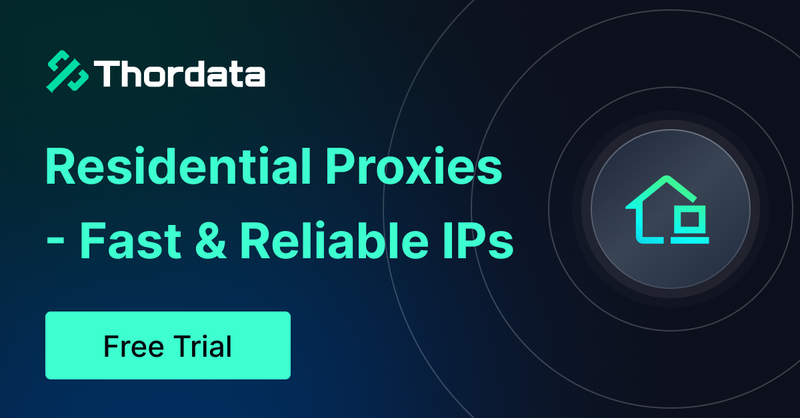

# Real Estate Scraper

---

This project is supported by Thordata.



[ThorData Web Scraper](https://www.thordata.com/products/web-scraper/?ls=github&lk=scraping) provides unblockable proxy infrastructure and scraping solutions for reliable, real-time web data extraction at scale. Perfect for AI training data collection, web automation, and large-scale scraping operations that require high performance and stability.

Key Advantages of ThorData:

* **Massive proxy network:** Access to 60M+ ethically sourced residential, mobile, ISP, and datacenter IPs across 190+ countries.
* **Enterprise-grade reliability:** 99.9% uptime with ultra-low latency (<0.5s response time) for uninterrupted data collection.
* **Flexible proxy types:** Choose from residential, mobile (4G/5G), static ISP, or datacenter proxies based on your needs.
* **Cost-effective pricing:** Starting from $1.80/GB for residential proxies with no traffic expiration and pay-as-you-go model.
* **Advanced targeting:** City-level geolocation targeting with automatic IP rotation and unlimited bandwidth Options.
* **Ready-to-use APIs:** 120+ scraper APIs and comprehensive datasets purpose-built for AI and data science workflows.

ThorData is SOC2, GDPR, and CCPA compliant, trusted by 4,000+ enterprises for secure web data extraction.

👉 Learn more: [ThorData](https://www.thordata.com/?ls=EDBORvrR&lk=wb) | [Get Started](https://www.thordata.com/?ls=EDBORvrR&lk=wb)

---

## 📁 Proje Yapısı

```
real-estate-scraper/
├── Backend/                 # Web scraping modülleri
│   ├── core/               # Temel bileşenler
│   ├── scrapers/           # Platform-spesifik scraperlar
│   ├── go/                # Go proxy server (Cloudflare bypass)
│   ├── python_proxy/       # Python client for Go proxy
│   ├── utils/              # Yardımcı araçlar
│   └── main.py             # Ana giriş noktası
└── Frontend/               # Next.js frontend
```

---

## 🛡️ Invisible Go Proxy - Cloudflare Bypass

Advanced proxy server with uTLS fingerprint spoofing for bypassing Cloudflare protection.

### 🎯 Özellikler

- **TLS Parmak İzi Spoofing**: Chrome 120 tarayıcı parmak izlerini taklit eder
- **Mobil Proxy Desteği**: İsteğe bağlı mobil/konut proxy entegrasyonu
- **Bağlantı Havuzu**: Yeniden kullanılabilir HTTP bağlantıları
- **Akıllı Yeniden Deneme**: Cloudflare challenge'ları için üstel geri sayma
- **Python Entegrasyonu**: Kolay kullanılabilir Python client

### 🚀 Hızlı Başlatma

#### Docker ile (Önerilen)
```bash
# Tüm sistem ile birlikte proxy'yi başlat
docker-compose up -d invisible-proxy

# Logları görüntüleme
docker-compose logs -f invisible-proxy

# Test et
curl http://127.0.0.1:8080/
python test_proxy.py
```

Not: Proxy için ayrı bir compose dosyası yoktur; kök dizindeki `docker-compose.yml` kullanılır.

### 📚 Detaylı Bilgi

Daha fazla bilgi için [Backend/go/README.md](Backend/go/README.md) dosyasına bakın.

---

## 🔧 Backend

Türkiye'deki emlak sitelerinden veri çekmek için geliştirilmiş modüler scraping sistemi.

### Desteklenen Platformlar

| Platform | Durum | Kategoriler |
|----------|-------|-------------|
| EmlakJet | ✅ Aktif | Konut, Arsa, İşyeri, Turistik Tesis |
| HepsiEmlak | ✅ Aktif | Konut, Arsa, İşyeri, Devremülk, Turistik İşletme |
| Sahibinden | 🔜 Planlanıyor | - |

### Kurulum

```bash
cd Backend
pip install selenium pandas openpyxl
```

### Kullanım

```bash
python main.py
```

**Akış:**
1. Platform seçin (EmlakJet / HepsiEmlak)
2. Kategori seçin (Konut, Arsa, vb.)
3. İl seçin (çoklu seçim: `1,3,5` veya `1-5`)
4. Her il için ilçe/mahalle belirleyin
5. Sayfa sayısını girin → Scraping başlar

### Özellikler

- 🏙️ **Hiyerarşik Lokasyon:** İl → İlçe → Mahalle seçimi
- 📊 **4 Sütunlu Görünüm:** Şehirler 4 sütunda listelenir
- 💾 **Otomatik Kayıt:** `Outputs/{Platform}/{Kategori}/` klasörüne Excel olarak kaydedilir
- ⏹️ **Ctrl+C Desteği:** İptal edilse bile mevcut veriler kaydedilir
- 🔢 **İlan Sayısı:** Her il için toplam ilan sayısı gösterilir

### Çıktı Yapısı

```
Outputs/
├── EmlakJet Output/
│   ├── konut/
│   └── arsa/
└── HepsiEmlak Output/
    └── konut/
```

---

## 📝 Lisans

MIT License
